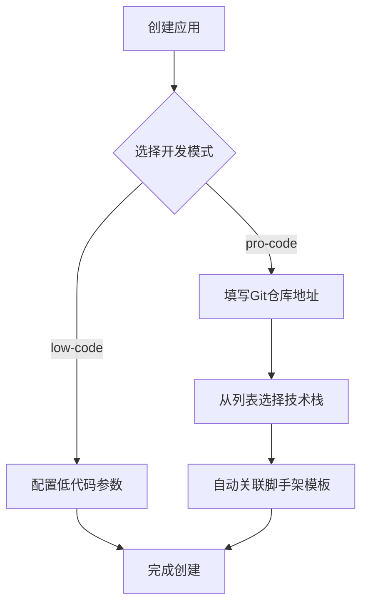
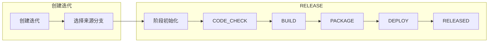
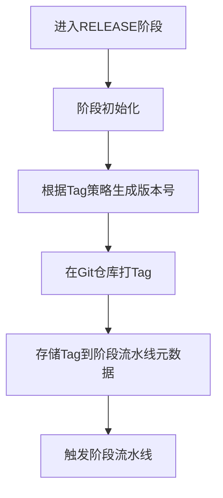
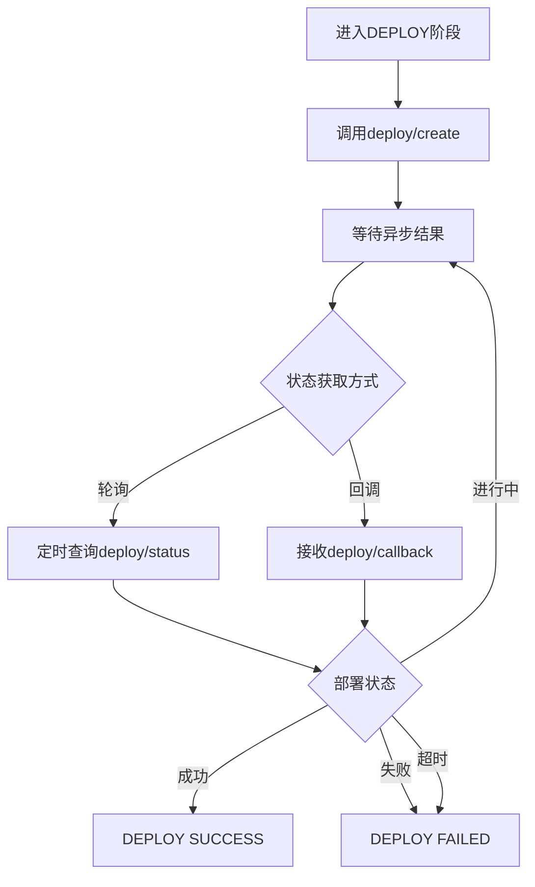
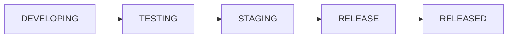
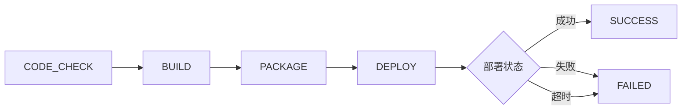
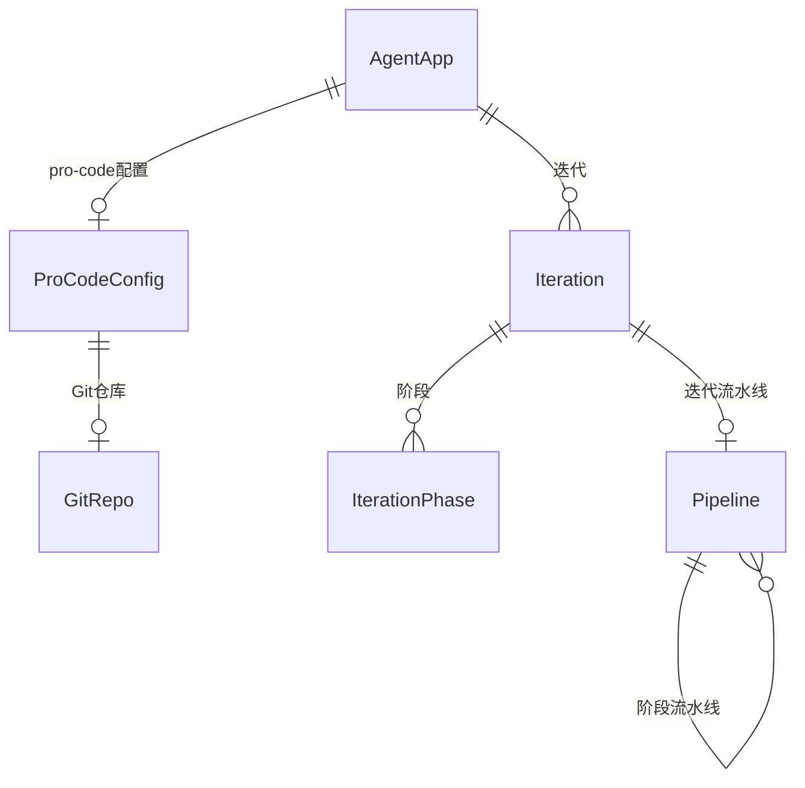

# Pro-code 高代码开发模式概要设计

## 1. 背景 & 目标

### 业务背景

现有 AI Agent 低代码开发平台需要升级，支持高代码（pro-code）开发模式。与低代码通过可视化配置不同，高代码通过 SDK 进行开发，面向外部开发者提供更灵活的定制能力。

### 要解决的问题

- 支持外部开发者通过 SDK 开发 AI Agent
- 提供完整的开发管理能力（Git、迭代、流水线）
- 与现有低代码模式共存，共享平台基础设施

### 成功指标

- 外部开发者可通过脚手架快速初始化项目
- 支持完整的迭代发布流程
- 流水线支持断点续跑，保证可靠性

---

## 2. 架构设计

### 系统架构图

```
┌─────────────────────────────────────────────────────────────┐
│                    AI Agent 平台                             │
├─────────────┬─────────────────────┬─────────────────────────┤
│  应用管理    │     开发管理         │       运维管理          │
│  (升级)     │     (新增)          │       (接口定义)        │
├─────────────┼─────────────────────┼─────────────────────────┤
│ 低代码配置   │ Git仓库对接          │                         │
│ Pro-code配置│ 迭代/版本管理        │    deploy/create        │
│             │ 流水线管理           │    deploy/status        │
│             │                      │    deploy/callback      │
└─────────────┴─────────────────────┴─────────────────────────┘
         │              │                      │
         ▼              ▼                      ▼
    [元数据存储]   [外部GitLab]           [K8s基础设施]
                  [WebIDE服务]
```

### 技术选型

| 组件 | 技术 | 选型理由 |
|------|------|----------|
| 后端框架 | Java + Spring Boot | 复用现有技术栈，降低学习成本 |
| Git 操作 | JGit / GitLab4J API | 支持多种 Git 托管平台 |
| 流水线 | Spring State Machine | 持久化 + 断点续跑，与 Spring 生态集成 |
| 存储 | MySQL | 复用现有数据库，运维成本低 |

### 关键设计决策

1. **单体扩展**：在现有服务中增加高代码模块，共用数据库和基础能力
2. **高/低代码共存不可切换**：应用创建时确定模式，后续不可更改
3. **运维接口先行**：一期定义接口规范，实现留白

---

## 3. 核心流程

### 3.1 应用创建流程



**说明**：
- **技术栈**：用户从预定义列表选择（一期仅支持 `python`，后续扩展 `java`、`nodejs`）
- **脚手架模板**：根据选择的技术栈自动关联对应模板，无需用户手动配置

### 3.2 迭代发布流程

#### 完整流程

迭代从创建到发布经历多个阶段，每个阶段触发阶段流水线执行。

```mermaid
flowchart LR
    subgraph 创建迭代
        A1[创建迭代] --> A2[选择来源分支]
    end

    subgraph DEVELOPING
        A2 --> B1[功能开发]
    end

    subgraph TESTING
        B1 --> C1[CODE_CHECK]
        C1 --> C2[BUILD]
        C2 --> C3[PACKAGE]
        C3 --> C4[DEPLOY]
    end

    subgraph STAGING
        C4 --> D1[CODE_CHECK]
        D1 --> D2[BUILD]
        D2 --> D3[PACKAGE]
        D3 --> D4[DEPLOY]
    end

    subgraph RELEASE
        D4 --> E0[阶段初始化]
        E0 --> E1[CODE_CHECK]
        E1 --> E2[BUILD]
        E2 --> E3[PACKAGE]
        E3 --> E4[DEPLOY]
        E4 --> E5[RELEASED]
    end
```



#### 简化流程（一期实现）

一期简化为单阶段发布流程，跳过测试和预发阶段。



#### RELEASE 阶段初始化逻辑

进入 RELEASE 阶段时，先执行初始化逻辑，再触发阶段流水线。



**Tag 策略（一期简化）：**

| 配置项 | 说明 |
|--------|------|
| `tagStrategy` | Tag 生成策略，一期固定为 `v{timestamp}` |
| `tag` | 生成的 Tag 值，存储在 `PipelineStage.context` 中 |

**元数据存储：**

```json
{
  "pipelineId": "xxx",
  "stage": "RELEASE",
  "context": {
    "tag": "v20260227143000",
    "branch": "main",
    "commitHash": "abc123"
  }
}
```

#### DEPLOY 阶段内部状态处理

DEPLOY 阶段采用异步驱动（ASYNC），通过轮询+回调双保险机制获取部署状态。



#### 完整 vs 简化 对比

| 对比项 | 完整流程 | 简化流程（一期） |
|--------|----------|------------------|
| 迭代阶段 | DEVELOPING → TESTING → STAGING → RELEASE | 直接 RELEASE |
| 环境数量 | 3个（测试、预发、生产） | 1个（生产） |
| 阶段流水线次数 | 3次（测试、预发、发布各一次） | 1次 |
| 适用场景 | 正式生产环境 | 快速迭代 / 内部测试 |

### 3.3 流水线架构

**两种流水线类型（复用流水线能力）：**

| 类型 | 说明 | 状态流转 |
|------|------|----------|
| **迭代流水线** | 管理迭代阶段流转 | 开发中 → 测试 → 预发 → 发布 |
| **阶段流水线** | 管理阶段内具体执行 | CODE_CHECK → BUILD → PACKAGE → DEPLOY |

**关系：**
```
迭代流水线 (ITERATION)
  │
  ├── 阶段流水线 (PHASE, stage=TESTING)
  ├── 阶段流水线 (PHASE, stage=STAGING)
  └── 阶段流水线 (PHASE, stage=RELEASE)
```

**一期简化：**
- 迭代流水线：只有 RELEASE 一个阶段
- 进入发布阶段时，自动创建阶段流水线

### 3.4 迭代流水线执行流程



### 3.5 阶段流水线执行流程



### 3.6 流水线推进驱动机制

**统一的阶段配置模型：**

所有流水线阶段使用统一的配置模型，通过配置区分不同驱动方式。

| 配置项 | 说明 | 可选值 |
|-------|------|--------|
| `driveMode` | 驱动方式 | MANUAL（手动推进）/ AUTO（自动推进）/ ASYNC（异步驱动） |
| `retryMode` | 失败后的重试方式 | AUTO / MANUAL |
| `maxRetries` | 自动重试最大次数 | 0-5 |
| `pollInterval` | 轮询间隔（仅ASYNC） | 秒 |
| `pollTimeout` | 超时时间（仅ASYNC） | 秒 |

**三种驱动方式说明：**

| 驱动方式 | 说明 | 适用场景 |
|---------|------|----------|
| MANUAL | 阶段完成后需手动点击进入下一阶段 | 需人工确认的关键阶段 |
| AUTO | 阶段成功后自动进入下一阶段 | 可自动流转的阶段 |
| ASYNC | 阶段启动后异步等待结果，轮询+回调双保险 | 长时间异步操作（如部署） |

#### 迭代流水线默认配置

迭代流水线的所有阶段默认配置为**手动推进**，确保人对发布流程有完全控制。

| 阶段 | driveMode | retryMode | maxRetries |
|------|-----------|-----------|------------|
| DEVELOPING | MANUAL | MANUAL | 0 |
| TESTING | MANUAL | MANUAL | 0 |
| STAGING | MANUAL | MANUAL | 0 |
| RELEASE | MANUAL | MANUAL | 0 |

#### 阶段流水线默认配置

| 阶段 | driveMode | retryMode | maxRetries | 说明 |
|------|-----------|-----------|------------|------|
| CODE_CHECK | AUTO | AUTO | 3 | 自动检查，失败自动重试 |
| BUILD | AUTO | AUTO | 2 | 自动构建，失败自动重试 |
| PACKAGE | AUTO | MANUAL | 0 | 自动打包，失败需人工排查 |
| DEPLOY | ASYNC | MANUAL | 0 | 异步部署，轮询+回调 |
| | | | | pollInterval=30s, pollTimeout=30min |

#### DEPLOY 阶段异步驱动

采用**轮询 + 回调双保险**机制：

- **轮询**：流水线定时查询运维模块部署状态
- **回调**：运维模块主动推送部署结果
- 任一方式收到成功/失败，即可推进状态机

| 配置项 | 默认值 | 说明 |
|-------|-------|------|
| `pollInterval` | 30s | 轮询间隔 |
| `pollTimeout` | 30min | 超时时间 |

---

## 4. 模块划分

### 4.1 应用管理模块（升级）

| 功能 | 说明 |
|------|------|
| Agent 应用管理 | 增加dev_mode字段区分高/低代码 |
| Pro-code 配置 | 存储 Git 仓库、技术栈、脚手架等配置 |

### 4.2 开发管理模块（新增）

| 功能 | 说明 |
|------|------|
| Git 仓库对接 | 对接外部 GitLab，管理 webhook |
| 迭代管理 | 管理迭代、阶段、版本 |
| 流水线管理 | 流水线创建、执行、断点续跑 |

### 4.3 运维管理模块（接口定义）

| 接口 | 说明 |
|------|------|
| deploy/create | 创建部署任务 |
| deploy/status | 查询部署状态 |
| deploy/callback | 部署状态回调 |

---

## 5. 接口清单

### 应用管理模块

| 接口 | 方法 | 用途 |
|------|------|------|
| /apps | POST | 创建应用 |
| /apps/{id} | GET | 获取应用详情 |
| /apps/{id}/procode-config | PUT | 配置 pro-code 参数 |

### 开发管理模块

| 接口 | 方法 | 用途 |
|------|------|------|
| /repos | POST | 创建 Git 仓库配置 |
| /repos/{id}/webhook | GET | 获取 webhook 配置 |
| /iterations | POST | 创建迭代 |
| /iterations/{id} | GET | 获取迭代详情 |
| /iterations/{id}/release | POST | 进入发布阶段 |
| /iterations/{id}/proceed | POST | 推进迭代流水线 |
| /pipelines | POST | 创建流水线 |
| /pipelines/{id} | GET | 获取流水线状态 |
| /pipelines/{id}/proceed | POST | 推进阶段流水线 |
| /pipelines/{id}/retry | POST | 重试当前阶段 |
| /pipelines/{id}/resume | POST | 断点续跑 |
| /pipelines/{id}/cancel | POST | 取消流水线 |

---

## 6. 核心数据实体



---

## 7. 主要风险

| 风险 | 影响 | 应对 |
|------|------|------|
| 外部 GitLab 连接不稳定 | 代码拉取失败、流水线中断 | 增加重试机制、超时配置 |
| 流水线执行时间过长 | 资源占用、用户体验差 | 异步执行 + 状态通知 |
| WebIDE 对接延迟 | 开发环境不可用 | 接口超时降级、状态检查 |
| 部署异步状态丢失 | 流水线卡死 | 轮询 + 回调双保险 |

---

## 8. 一期范围

- [x] 应用管理支持 pro-code 模式
- [x] Git 仓库对接（外部 GitLab）
- [x] 迭代管理（简化：只有发布阶段）
- [x] 流水线（CODE_CHECK → BUILD → PACKAGE → DEPLOY）
- [ ] 运维管理（接口定义，实现留白）

---

> [!note] 评审记录
> - 日期：
> - 参与人：
> - 结论：
