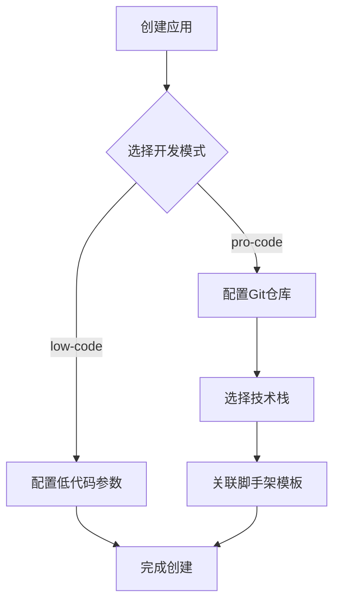
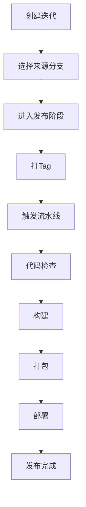
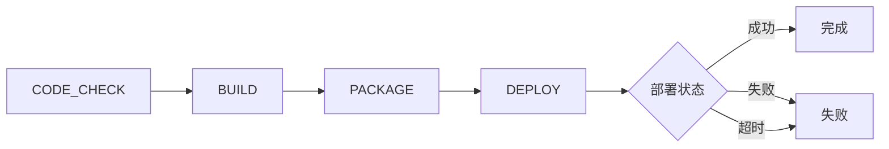
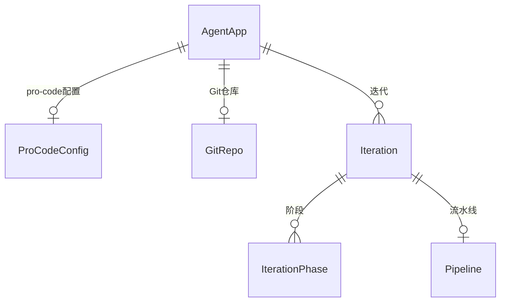

# Pro-code 高代码开发模式概要设计

## 1. 背景 & 目标

### 业务背景

现有 AI Agent 低代码开发平台需要升级，支持高代码（pro-code）开发模式。与低代码通过可视化配置不同，高代码通过 SDK 进行开发，面向外部开发者提供更灵活的定制能力。

### 要解决的问题

- 支持外部开发者通过 SDK 开发 AI Agent
- 提供完整的开发管理能力（Git、迭代、流水线）
- 与现有低代码模式共存，共享平台基础设施

### 成功指标

- 外部开发者可通过脚手架快速初始化项目
- 支持完整的迭代发布流程
- 流水线支持断点续跑，保证可靠性

---

## 2. 架构设计

### 系统架构图

```
┌─────────────────────────────────────────────────────────────┐
│                    AI Agent 平台                             │
├─────────────┬─────────────────────┬─────────────────────────┤
│  应用管理    │     开发管理         │       运维管理          │
│  (升级)     │     (新增)          │       (接口定义)        │
├─────────────┼─────────────────────┼─────────────────────────┤
│ 低代码配置   │ Git仓库对接          │                         │
│ Pro-code配置│ 迭代/版本管理        │    deploy/create        │
│             │ 流水线管理           │    deploy/status        │
│             │                      │    deploy/callback      │
└─────────────┴─────────────────────┴─────────────────────────┘
         │              │                      │
         ▼              ▼                      ▼
    [元数据存储]   [外部GitLab]           [K8s基础设施]
                  [WebIDE服务]
```

### 技术选型

| 组件 | 技术 | 选型理由 |
|------|------|----------|
| 后端框架 | Java + Spring Boot | 复用现有技术栈，降低学习成本 |
| Git 操作 | JGit / GitLab4J API | 支持多种 Git 托管平台 |
| 流水线 | Spring State Machine | 持久化 + 断点续跑，与 Spring 生态集成 |
| 存储 | MySQL | 复用现有数据库，运维成本低 |

### 关键设计决策

1. **单体扩展**：在现有服务中增加高代码模块，共用数据库和基础能力
2. **高/低代码共存不可切换**：应用创建时确定模式，后续不可更改
3. **运维接口先行**：一期定义接口规范，实现留白

---

## 3. 核心流程

### 3.1 应用创建流程



### 3.2 迭代发布流程（一期简化）



### 3.3 流水线执行流程



---

## 4. 模块划分

### 4.1 应用管理模块（升级）

| 功能 | 说明 |
|------|------|
| Agent 应用管理 | 增加dev_mode字段区分高/低代码 |
| Pro-code 配置 | 存储 Git 仓库、技术栈、脚手架等配置 |

### 4.2 开发管理模块（新增）

| 功能 | 说明 |
|------|------|
| Git 仓库对接 | 对接外部 GitLab，管理 webhook |
| 迭代管理 | 管理迭代、阶段、版本 |
| 流水线管理 | 流水线创建、执行、断点续跑 |

### 4.3 运维管理模块（接口定义）

| 接口 | 说明 |
|------|------|
| deploy/create | 创建部署任务 |
| deploy/status | 查询部署状态 |
| deploy/callback | 部署状态回调 |

---

## 5. 接口清单

### 应用管理模块

| 接口 | 方法 | 用途 |
|------|------|------|
| /apps | POST | 创建应用 |
| /apps/{id} | GET | 获取应用详情 |
| /apps/{id}/procode-config | PUT | 配置 pro-code 参数 |

### 开发管理模块

| 接口 | 方法 | 用途 |
|------|------|------|
| /repos | POST | 创建 Git 仓库配置 |
| /repos/{id}/webhook | GET | 获取 webhook 配置 |
| /iterations | POST | 创建迭代 |
| /iterations/{id} | GET | 获取迭代详情 |
| /iterations/{id}/release | POST | 进入发布阶段 |
| /pipelines | POST | 创建流水线 |
| /pipelines/{id} | GET | 获取流水线状态 |
| /pipelines/{id}/resume | POST | 断点续跑 |
| /pipelines/{id}/cancel | POST | 取消流水线 |

---

## 6. 核心数据实体



---

## 7. 主要风险

| 风险 | 影响 | 应对 |
|------|------|------|
| 外部 GitLab 连接不稳定 | 代码拉取失败、流水线中断 | 增加重试机制、超时配置 |
| 流水线执行时间过长 | 资源占用、用户体验差 | 异步执行 + 状态通知 |
| WebIDE 对接延迟 | 开发环境不可用 | 接口超时降级、状态检查 |
| 部署异步状态丢失 | 流水线卡死 | 轮询 + 回调双保险 |

---

## 8. 一期范围

- [x] 应用管理支持 pro-code 模式
- [x] Git 仓库对接（外部 GitLab）
- [x] 迭代管理（简化：只有发布阶段）
- [x] 流水线（CODE_CHECK → BUILD → PACKAGE → DEPLOY）
- [ ] 运维管理（接口定义，实现留白）

---

> [!note] 评审记录
> - 日期：
> - 参与人：
> - 结论：
