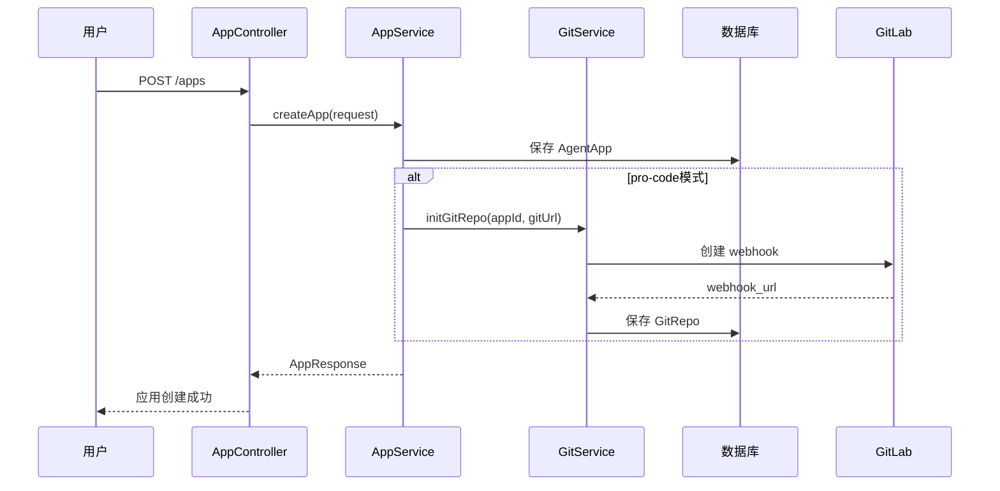
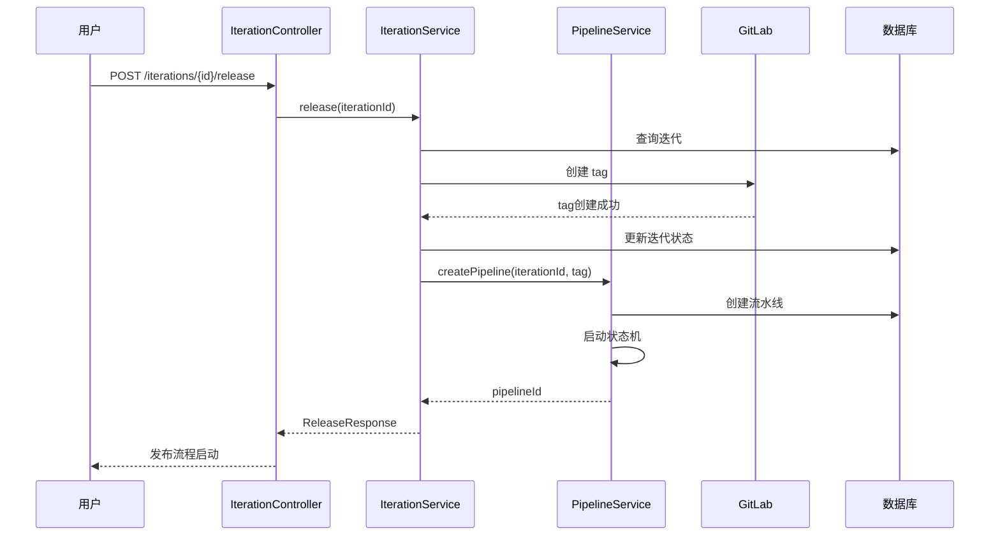
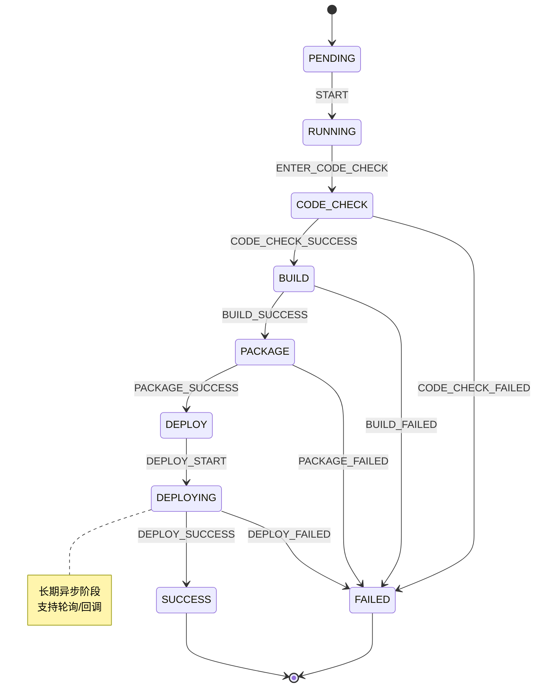
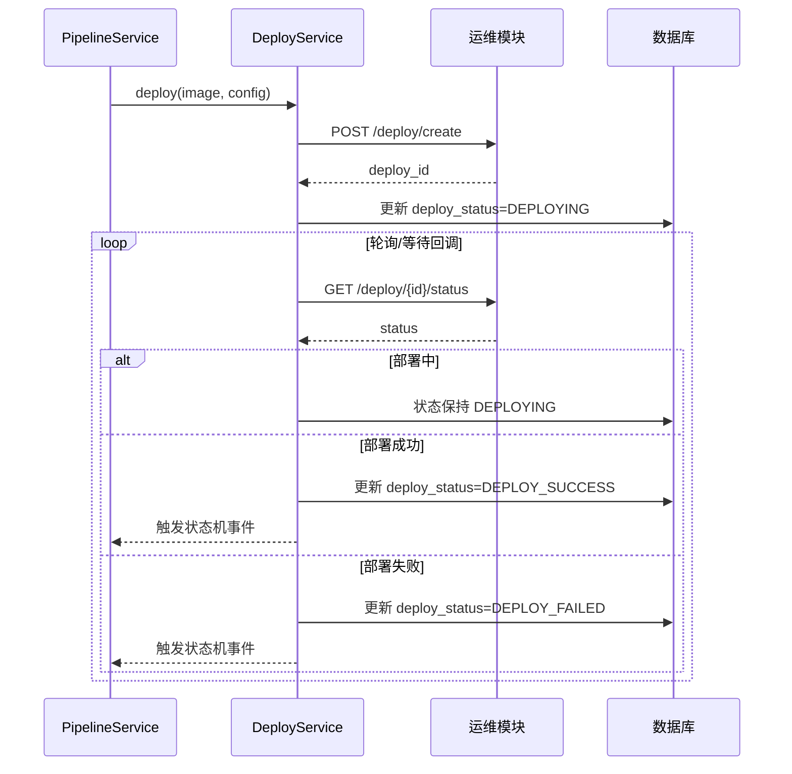

# Pro-code 高代码开发模式详细设计

## 1. 模块设计

### 1.1 模块划分

```
com.example.platform
├── app                          # 应用管理模块
│   ├── controller
│   │   └── AppController.java
│   ├── service
│   │   ├── AppService.java
│   │   └── ProCodeConfigService.java
│   ├── entity
│   │   ├── AgentApp.java
│   │   └── ProCodeConfig.java
│   └── repository
│       └── AppRepository.java
│
├── dev                          # 开发管理模块
│   ├── controller
│   │   ├── RepoController.java
│   │   ├── IterationController.java
│   │   └── PipelineController.java
│   ├── service
│   │   ├── GitService.java
│   │   ├── IterationService.java
│   │   └── PipelineService.java
│   ├── entity
│   │   ├── GitRepo.java
│   │   ├── Iteration.java
│   │   ├── IterationPhase.java
│   │   └── Pipeline.java
│   ├── statemachine
│   │   ├── PipelineStateMachine.java
│   │   ├── PipelineState.java
│   │   ├── PipelineEvent.java
│   │   └── PipelineAction.java
│   └── integration
│       ├── GitLabClient.java
│       └── WebIdeClient.java
│
└── ops                          # 运维管理模块（接口定义）
    ├── controller
    │   └── DeployController.java
    ├── dto
    │   ├── DeployRequest.java
    │   ├── DeployResponse.java
    │   └── DeployStatusResponse.java
    └── service
        └── DeployService.java   # 空实现，二期补充
```

### 1.2 核心类设计

**应用管理：**

```java
// AgentApp.java
@Entity
public class AgentApp {
    private Long id;
    private String name;
    private DevMode devMode;        // LOW_CODE, PRO_CODE
    private String techStack;       // python, java, nodejs
}

// ProCodeConfig.java
@Entity
public class ProCodeConfig {
    private Long appId;
    private String gitRepoUrl;
    private String scaffoldTemplate;
    private String webhookSecret;
}
```

**开发管理：**

```java
// GitRepo.java
@Entity
public class GitRepo {
    private Long id;
    private Long appId;
    private String externalGitUrl;
    private GitType gitType;        // GITLAB, GITHUB, GITEE
    private String credentialId;
    private String webhookUrl;
}

// Iteration.java
@Entity
public class Iteration {
    private Long id;
    private Long appId;
    private String name;
    private IterationStatus status;
    private String sourceBranch;
    private String currentPhase;
}

// Pipeline.java
@Entity
public class Pipeline {
    private Long id;
    private Long iterationId;
    private PipelineStatus status;
    private PipelineStage currentStage;
    private DeployStatus deployStatus;
    private String deployId;
    private String checkpoints;     // JSON
}
```

---

## 2. 流程设计

### 2.1 应用创建时序图



### 2.2 迭代发布时序图



### 2.3 流水线状态机



### 2.4 部署异步交互时序图



---

## 3. 接口定义

### 3.1 创建应用

- **路径**：`POST /apps`
- **描述**：创建应用（低代码或高代码）

**请求参数**：

| 参数 | 类型 | 必填 | 校验规则 | 说明 |
|------|------|------|----------|------|
| name | String | 是 | 1-100字符 | 应用名称 |
| devMode | String | 是 | 枚举: low-code, pro-code | 开发模式 |
| techStack | String | pro-code必填 | 枚举: python | 技术栈 |
| gitRepoUrl | String | pro-code必填 | URL格式 | Git仓库地址 |
| scaffoldTemplate | String | 否 | - | 脚手架模板 |

**响应格式**：

```json
{
  "code": 0,
  "message": "success",
  "data": {
    "id": 123,
    "name": "my-agent",
    "devMode": "pro-code",
    "techStack": "python"
  }
}
```

**错误码**：

| 错误码 | 说明 |
|--------|------|
| 0 | 成功 |
| 1001 | 参数错误 |
| 1002 | 应用名称已存在 |
| 1003 | Git仓库不可访问 |

### 3.2 配置 Pro-code

- **路径**：`PUT /apps/{id}/procode-config`
- **描述**：配置 pro-code 参数

**请求参数**：

| 参数 | 类型 | 必填 | 校验规则 | 说明 |
|------|------|------|----------|------|
| gitRepoUrl | String | 是 | URL格式 | Git仓库地址 |
| scaffoldTemplate | String | 否 | - | 脚手架模板 |
| credentialId | String | 是 | - | Git凭证ID |

**响应格式**：

```json
{
  "code": 0,
  "message": "success",
  "data": {
    "appId": 123,
    "gitRepoUrl": "https://gitlab.example.com/my-agent.git",
    "webhookUrl": "https://platform.example.com/webhook/xxx"
  }
}
```

### 3.3 创建迭代

- **路径**：`POST /iterations`
- **描述**：创建迭代

**请求参数**：

| 参数 | 类型 | 必填 | 校验规则 | 说明 |
|------|------|------|----------|------|
| appId | Long | 是 | - | 应用ID |
| name | String | 是 | 1-100字符 | 迭代名称 |
| sourceBranch | String | 是 | - | 来源分支 |

**响应格式**：

```json
{
  "code": 0,
  "message": "success",
  "data": {
    "id": 456,
    "appId": 123,
    "name": "v1.0.0",
    "status": "DRAFT",
    "sourceBranch": "main"
  }
}
```

### 3.4 进入发布阶段

- **路径**：`POST /iterations/{id}/release`
- **描述**：进入发布阶段，打tag并触发流水线

**请求参数**：

| 参数 | 类型 | 必填 | 校验规则 | 说明 |
|------|------|------|----------|------|
| tag | String | 是 | v开头的版本号 | 发布版本tag |

**响应格式**：

```json
{
  "code": 0,
  "message": "success",
  "data": {
    "iterationId": 456,
    "tag": "v1.0.0",
    "pipelineId": 789,
    "status": "RUNNING"
  }
}
```

### 3.5 获取流水线状态

- **路径**：`GET /pipelines/{id}`
- **描述**：获取流水线执行状态

**响应格式**：

```json
{
  "code": 0,
  "message": "success",
  "data": {
    "id": 789,
    "iterationId": 456,
    "status": "RUNNING",
    "currentStage": "DEPLOY",
    "deployStatus": "DEPLOYING",
    "checkpoints": [
      {
        "stage": "CODE_CHECK",
        "status": "SUCCESS",
        "output": {"commitId": "abc123"}
      },
      {
        "stage": "BUILD",
        "status": "SUCCESS",
        "output": {"dockerfile": "..."}
      },
      {
        "stage": "PACKAGE",
        "status": "SUCCESS",
        "output": {"image": "registry/xxx:v1.0.0"}
      }
    ],
    "createdAt": "2026-02-27T10:00:00Z",
    "updatedAt": "2026-02-27T10:05:00Z"
  }
}
```

### 3.6 断点续跑

- **路径**：`POST /pipelines/{id}/resume`
- **描述**：从中断点恢复流水线执行

**响应格式**：

```json
{
  "code": 0,
  "message": "success",
  "data": {
    "pipelineId": 789,
    "status": "RUNNING",
    "resumeFromStage": "DEPLOY"
  }
}
```

### 3.7 运维模块接口（定义，实现留白）

**创建部署**：`POST /deploy/create`

```json
// 请求
{
  "appId": 123,
  "image": "registry/xxx:v1.0.0",
  "config": {
    "env": {"KEY": "VALUE"},
    "resources": {"cpu": "1", "memory": "2Gi"}
  }
}

// 响应
{
  "code": 0,
  "data": {
    "deployId": "deploy-xxx",
    "status": "PENDING"
  }
}
```

**查询部署状态**：`GET /deploy/{id}/status`

```json
{
  "code": 0,
  "data": {
    "deployId": "deploy-xxx",
    "status": "RUNNING",
    "message": "正在启动容器..."
  }
}
```

**部署回调**：`POST /deploy/callback`

```json
{
  "deployId": "deploy-xxx",
  "status": "SUCCESS",
  "message": "部署成功",
  "timestamp": "2026-02-27T10:10:00Z"
}
```

---

## 4. 数据设计

### 4.1 表结构

**agent_app（应用表）**

| 字段 | 类型 | 约束 | 说明 |
|------|------|------|------|
| id | BIGINT | PK, AUTO_INCREMENT | 主键 |
| name | VARCHAR(100) | NOT NULL, UNIQUE | 应用名称 |
| dev_mode | VARCHAR(20) | NOT NULL, DEFAULT 'low-code' | 开发模式 |
| tech_stack | VARCHAR(50) | | 技术栈 |
| created_at | TIMESTAMP | DEFAULT CURRENT_TIMESTAMP | 创建时间 |
| updated_at | TIMESTAMP | ON UPDATE CURRENT_TIMESTAMP | 更新时间 |

**procode_config（Pro-code配置表）**

| 字段 | 类型 | 约束 | 说明 |
|------|------|------|------|
| id | BIGINT | PK, AUTO_INCREMENT | 主键 |
| app_id | BIGINT | NOT NULL, UNIQUE | 应用ID |
| git_repo_url | VARCHAR(500) | NOT NULL | Git仓库地址 |
| scaffold_template | VARCHAR(100) | | 脚手架模板 |
| webhook_secret | VARCHAR(100) | | Webhook密钥 |
| created_at | TIMESTAMP | DEFAULT CURRENT_TIMESTAMP | 创建时间 |
| updated_at | TIMESTAMP | ON UPDATE CURRENT_TIMESTAMP | 更新时间 |

**git_repo（Git仓库表）**

| 字段 | 类型 | 约束 | 说明 |
|------|------|------|------|
| id | BIGINT | PK, AUTO_INCREMENT | 主键 |
| app_id | BIGINT | NOT NULL, UNIQUE | 应用ID |
| external_git_url | VARCHAR(500) | NOT NULL | 外部Git地址 |
| git_type | VARCHAR(20) | | Git类型(gitlab/github/gitee) |
| credential_id | VARCHAR(100) | | 凭证ID |
| webhook_url | VARCHAR(500) | | Webhook地址 |
| created_at | TIMESTAMP | DEFAULT CURRENT_TIMESTAMP | 创建时间 |

**iteration（迭代表）**

| 字段 | 类型 | 约束 | 说明 |
|------|------|------|------|
| id | BIGINT | PK, AUTO_INCREMENT | 主键 |
| app_id | BIGINT | NOT NULL | 应用ID |
| name | VARCHAR(100) | NOT NULL | 迭代名称 |
| status | VARCHAR(20) | NOT NULL, DEFAULT 'DRAFT' | 状态 |
| source_branch | VARCHAR(100) | NOT NULL | 来源分支 |
| current_phase | VARCHAR(20) | | 当前阶段 |
| created_at | TIMESTAMP | DEFAULT CURRENT_TIMESTAMP | 创建时间 |
| updated_at | TIMESTAMP | ON UPDATE CURRENT_TIMESTAMP | 更新时间 |

**iteration_phase（迭代阶段表）**

| 字段 | 类型 | 约束 | 说明 |
|------|------|------|------|
| id | BIGINT | PK, AUTO_INCREMENT | 主键 |
| iteration_id | BIGINT | NOT NULL | 迭代ID |
| phase_type | VARCHAR(20) | NOT NULL | 阶段类型(RELEASE) |
| branch | VARCHAR(100) | | 关联分支 |
| tag | VARCHAR(100) | | 版本tag |
| status | VARCHAR(20) | DEFAULT 'PENDING' | 状态 |
| created_at | TIMESTAMP | DEFAULT CURRENT_TIMESTAMP | 创建时间 |

**pipeline（流水线表）**

| 字段 | 类型 | 约束 | 说明 |
|------|------|------|------|
| id | BIGINT | PK, AUTO_INCREMENT | 主键 |
| iteration_id | BIGINT | NOT NULL | 迭代ID |
| status | VARCHAR(20) | NOT NULL, DEFAULT 'PENDING' | 状态 |
| current_stage | VARCHAR(20) | | 当前阶段 |
| deploy_status | VARCHAR(20) | | 部署子状态 |
| deploy_id | VARCHAR(100) | | 部署ID |
| checkpoints | TEXT | | 检查点(JSON) |
| created_at | TIMESTAMP | DEFAULT CURRENT_TIMESTAMP | 创建时间 |
| updated_at | TIMESTAMP | ON UPDATE CURRENT_TIMESTAMP | 更新时间 |

### 4.2 索引设计

| 表 | 索引名 | 字段 | 类型 | 说明 |
|------|--------|------|------|------|
| agent_app | uk_name | name | UNIQUE | 应用名称唯一 |
| procode_config | uk_app_id | app_id | UNIQUE | 应用ID唯一 |
| git_repo | uk_app_id | app_id | UNIQUE | 应用ID唯一 |
| iteration | idx_app_id | app_id | INDEX | 按应用查询迭代 |
| iteration_phase | idx_iteration_id | iteration_id | INDEX | 按迭代查询阶段 |
| pipeline | idx_iteration_id | iteration_id | INDEX | 按迭代查询流水线 |
| pipeline | idx_status | status | INDEX | 按状态查询 |

---

## 5. 非功能需求

### 5.1 性能指标

| 指标 | 目标值 |
|------|--------|
| 接口响应时间 | < 200ms (P99) |
| 流水线并发数 | >= 100 |
| 迭代查询 | < 100ms |
| Git操作超时 | 30s |

### 5.2 可靠性

- 流水线断点续跑：状态机持久化，支持从中断点恢复
- Git操作重试：失败后自动重试3次，间隔递增
- 部署超时：默认30分钟，可配置

### 5.3 安全

- Git凭证加密存储
- Webhook签名验证
- API访问鉴权

---

## 6. 降级 & 回滚

### 6.1 降级策略

| 场景 | 降级方案 |
|------|----------|
| GitLab不可用 | 返回缓存数据，提示稍后重试 |
| WebIDE不可用 | 提示用户使用本地IDE |
| 运维模块不可用 | 流水线停在DEPLOY阶段，等待恢复 |
| 流水线执行失败 | 支持断点续跑，从失败阶段继续 |

### 6.2 回滚方案

- 迭代回滚：重新发布上一个版本的tag
- 流水线回滚：取消当前流水线，重新创建
- 数据回滚：通过数据库备份恢复

---

## 变更记录

| 日期 | 版本 | 变更内容 | 作者 |
|------|------|----------|------|
| 2026-02-27 | v1.0 | 初稿 | - |
