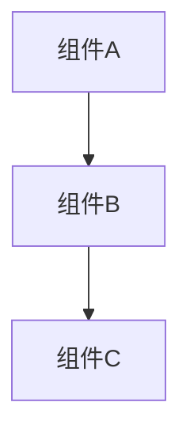
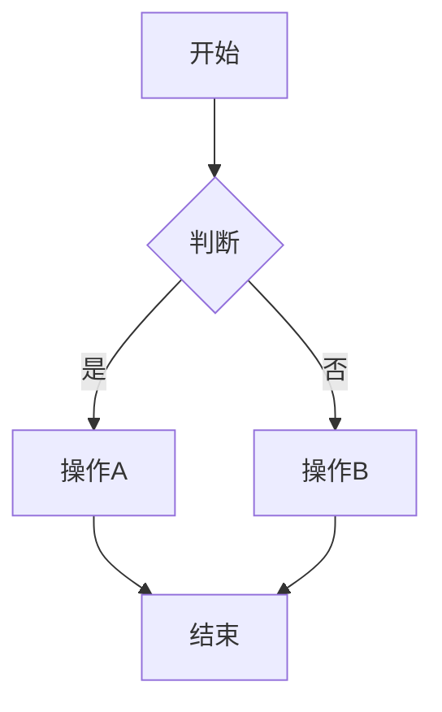
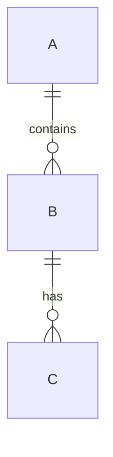

# [项目名称] 概要设计

## 1. 背景 & 目标

**业务背景**：

**要解决的问题**：

**成功指标**：

## 2. 架构设计

**系统架构图**：

**技术选型**：

| 技术 | 用途 | 选型理由 |
|------|------|----------|
|      |      |          |

## 3. 核心流程

**主流程图**：

**关键分支**：

## 4. 接口清单

| 接口 | 方法 | 用途 |
|------|------|------|
| /api/xxx | GET | xxx |
| /api/xxx | POST | xxx |

## 5. 核心数据实体

**实体关系图**：

## 6. 主要风险

| 风险 | 影响 | 应对 |
|------|------|------|
|      |      |      |
|      |      |      |

---

> [!note] 评审记录
> - 日期：
> - 参与人：
> - 结论：
