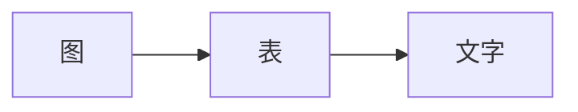

# 通用规则

## 写作禁忌

| 禁止 | 原因 |
|------|------|
| 禁止无图的长篇文字 | 难以理解，难以评审 |
| 禁止模糊表述 | "适当优化"、"尽量快"等无意义 |
| 禁止过时内容 | 文档与代码不一致比没有文档更糟 |
| 禁止复制粘贴 | 每个项目有自己的上下文 |

## 评审规则

| 阶段 | 评审重点 | 通过标准 |
|------|----------|----------|
| [[概要设计]] | 方向、决策、风险 | 方向正确、决策有据、风险可控 |
| [[详细设计]] | 可行性、完整性 | 可直接编码、无遗漏 |

## 迭代规则

1. **概要设计**：需求变更时必须更新
2. **详细设计**：代码变更时必须同步
3. **版本管理**：重大变更保留历史版本

## 表达优先级

> [!warning] 记住
> 能用图不用表，能用表不用文字

## 相关

- [[概要设计]]
- [[详细设计]]
