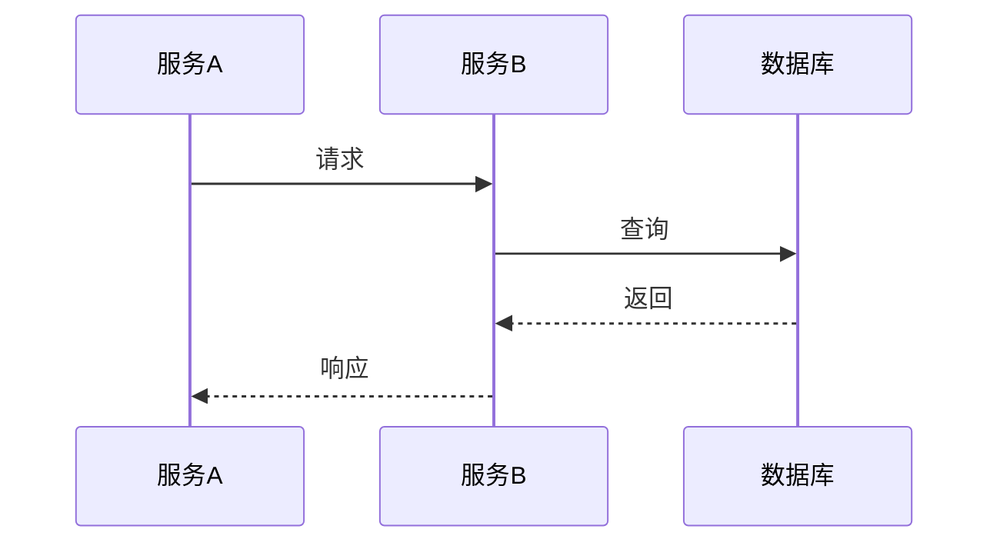
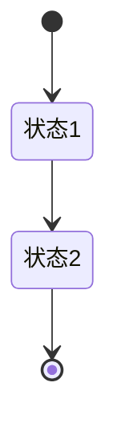

# [项目名称] 详细设计

## 1. 模块设计

**模块划分**：

**类/函数设计**：

## 2. 流程设计

**时序图**：



**状态图**（如有）：



## 3. 接口定义

### [接口名称]

- **路径**：`/api/xxx`
- **方法**：GET/POST/PUT/DELETE
- **描述**：

**请求参数**：

| 参数 | 类型 | 必填 | 校验规则 | 说明 |
|------|------|------|----------|------|
|      |      |      |          |      |

**响应格式**：

```json
{
  "code": 0,
  "message": "success",
  "data": {}
}
```

**错误码**：

| 错误码 | 说明 |
|--------|------|
| 0 | 成功 |
| 1001 | 参数错误 |

## 4. 数据设计

### [表名]

| 字段 | 类型 | 约束 | 说明 |
|------|------|------|------|
| id | BIGINT | PK, AUTO_INCREMENT | 主键 |
| | | | |

**索引设计**：

| 索引名 | 字段 | 类型 | 说明 |
|--------|------|------|------|
| | | | |

## 5. 非功能需求

**性能指标**：

| 指标 | 目标值 |
|------|--------|
| 响应时间 | < 200ms |
| QPS | > 1000 |

**安全方案**：

## 6. 降级 & 回滚

**降级策略**：

**回滚方案**：

**灰度计划**：

---

## 变更记录

| 日期 | 版本 | 变更内容 | 作者 |
|------|------|----------|------|
| | v1.0 | 初稿 | |
